거의 생초짜가 전문강사님의 강의를 듣고 다시 해 보며 부딪혀 본 내용을 기록한 것입니다.
백문이 불여일견입니다. 책 아무리 들여다보는 것 보다, 직접 하는 것이 낫고..
혼자 하는 것 보다 전문가의 도움을 받는 것이 훨씬 시간을 절약합니다.

@한동안 다른 일 하다가 다시 하려니 기억이 삭~ 날라갔네...워매...
@아무리 툴이 좋아도 1년정도는 붙들고 파고들어야 (1만시간 법칙) 할 수 있지... 게임을 만든다는게 개인 취미활동에는 한계가 있고.. 1인 개발자도 십년 이상 경력자가 아~ 이제 혼자 뭐 좀 만들어 볼까~ 할때나 가능한 일임. 괜히 게임이 3D 업종인게 아님. 정말 노가다+열정을 갈아넣어야.... 


# 드럼통을 배치하고 텍스처를 랜덤하게 입혀 보자

드럼통 배치 위치는 미리 정해주되, 입혀주는 텍스쳐는 바뀌도록 한다.

Barrel 을 애셋 스토어에서 찾아서 import 한다. 
여러개의 texture가 있는 녀석이어야 한다. 
걔를 Scene 화면에 끌어다 놓고, 다음 스크립트를 집어 넣는다. 
주된 내용으로 처음 실행될 때 Barrel에 달려 있는 MeshRenderer를 가져와서 등록되어 있는 texture들 중 임의의 하나를 선택하여 mainTexture가 되도록 해 주는 거다. 
OnCollisionEnter와 ExpBarrel은 일단 넘어가자.  

```csharp
using System.Collections;
using System.Collections.Generic;
using UnityEngine;

public class BarrelControl : MonoBehaviour
{

    public Texture [] textures;
    //[HideInInspector] // 바로 밑에 있는 것을 인스펙터에 노출시키지 않 . 그러나 외부 클래스에서 접근은 가능함
    public MeshRenderer _renderer;

    public GameObject expEffect;
    private int hitCount = 0 ;

    // Use this for initialization
    void Start()
    {
        _renderer = GetComponentInChildren< MeshRenderer >();

        int idx = Random .Range( 0 , textures.Length);
        _renderer.material.mainTexture = textures[idx];
    }

    void OnCollisionEnter( Collision coll)
    {
        if (coll.collider.CompareTag( "BULLET" ))
        {
            if (++hitCount == 3 )
            {
                ExpBarrel();
            }
        }

    }

    void ExpBarrel()
    {
        // rundtime 시에 rigidbody 를 추가할 수 있음
        Rigidbody rb = this .gameObject.AddComponent< Rigidbody >();
        rb.AddForce( Vector3 .up * 1500.0f );

        GameObject obj = Instantiate(expEffect, transform.position, Quaternion .identity);
        Destroy(obj, 5.0f );
    }
}

```

코드를 저장하고 유니티 UI로 돌아와서 아래 그림처럼 Textures 변수의 Element 들에다가 texture image를 끌어다가 놓는다. 

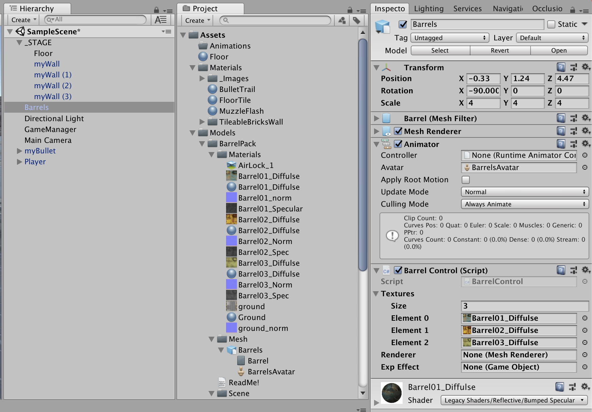

이제 Barrel을 여러개 복사해 넣는다. 
Command-d 를 누르면 현재 선택된 객체의 위치와 동일한 곳에 복사본이 생성된다. 얘를 끌어다가 적당한 위치에 배치시킨다. 

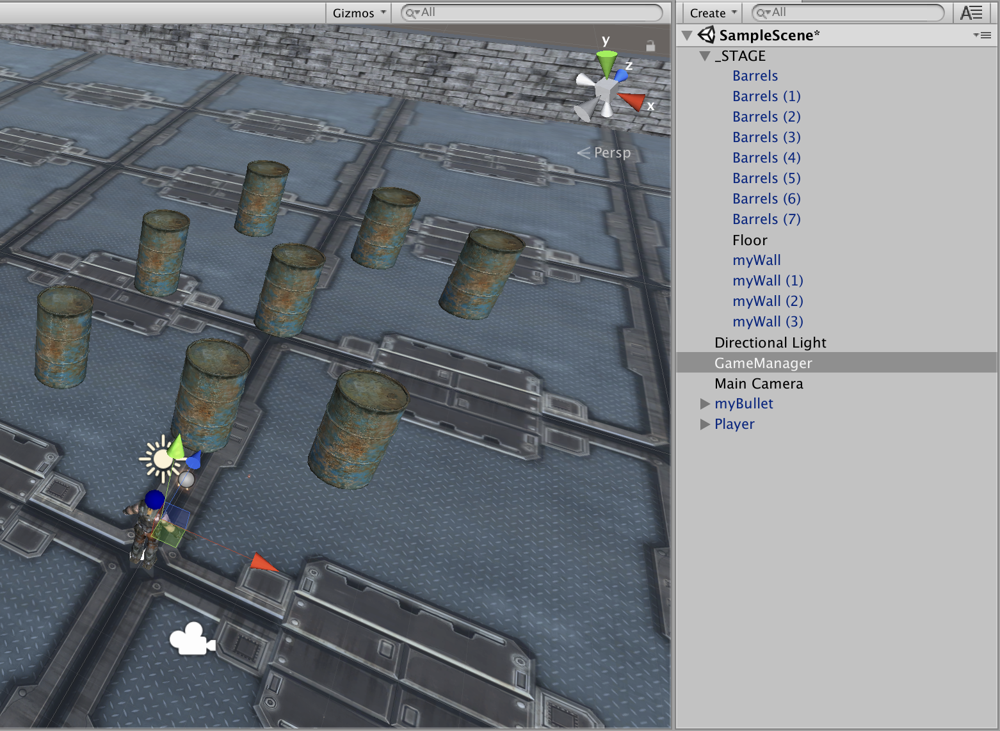

플레이해보면 다른 모양의 Barrel들이 배치된 것을 알 수 있다. 


# 총알을 만들고 날려보자

1. Asset Store에서 적당한 총알을 받아보자. 받은 모델에서 적당한 Prefab을 끌어다가 화면으로 가져온다.
2. 혹시 좌표가 뒤집혀져 있는 경우에는 GameObject를 하나 만들어 그 안에 집어넣고 회전을 시켜서 게임내에서 방향(xyz)을 일치화 시켜준다.
3. 그리고 그 bullet에 물리법칙을 반영하기 위해 RigidBody 컴퍼넌트를 추가하고, Gravity를 uncheck 하도록 하자.
4. 충돌탐지를 위해 Sphere Collider를 추가해주고, 실제 총알의 크기만큼 radius를 조절한다.
5. 또, 총알의 궤적을 달아주기 위해 Add Component를 통해 ‘Trail Renderer’를 추가한다. Trail Renderer에서 궤적의 생김새를 조절한다. 
6. Trail Renderer에서 사용할 material은 다음과 같이 만든다. 주의할 점으로 Shader는 Particles/Additive로 한다. 이렇게 해야 material에 맵핑할 이미지의 black 배경을 transparent로 바꿔준다.
7. 그리고, 얘를 Trail Renderer의 Materials의 Element 0에 끌어다가 놓는다. 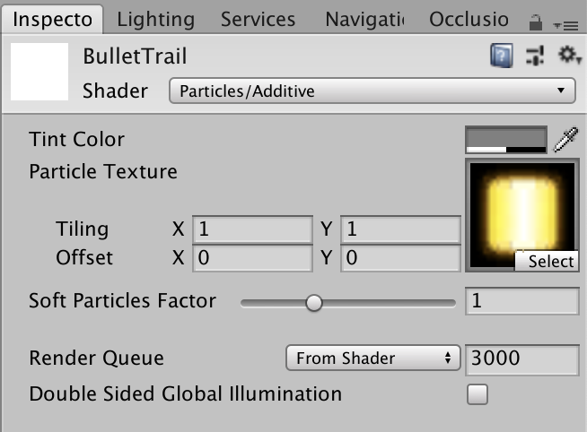
8. 총알이 날아가도록 하기 위해 C# 스크립트(BulletControl)를 하나 추가해서 달아준다. 주된 목적은 Rigidbody 객체에 힘을 정방향으로 할당해 주는 것이다.

```csharp
using System.Collections;
using System.Collections.Generic;
using UnityEngine;

public class BulletControl : MonoBehaviour
{

    private Rigidbody rb;

    // Use this for initialization
    void Start()
    {
        rb = GetComponent< Rigidbody >();
        rb.AddRelativeForce( Vector3 .forward * 1500.0f );

    }

    // Update is called once per frame
    // 사용하지 않는 update 는 없어야 함
    //void Update () {


    //}
}
```


# 모델에 총을 달고 총을 쏴보자

1. 먼저 모델에 총을 달아보자. 적당한 모델의 총을 애셋 스토어에서 다운 받아 import 한다.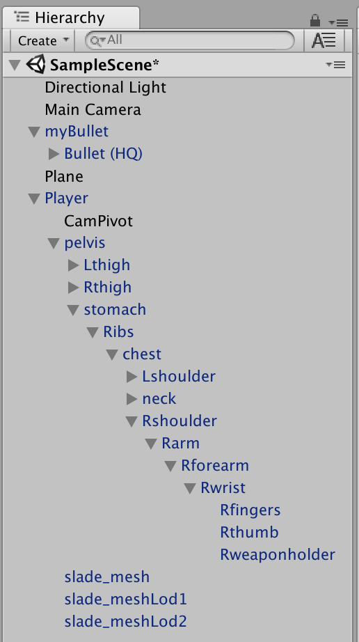
2. Player 모델의 트리를 따라 계속 내려가다가 weaponholder 를 찾아서 , 총 모델을 할당시킨다. 그럼 아래 그림과 같이 오른손에 총을 달게 된다. 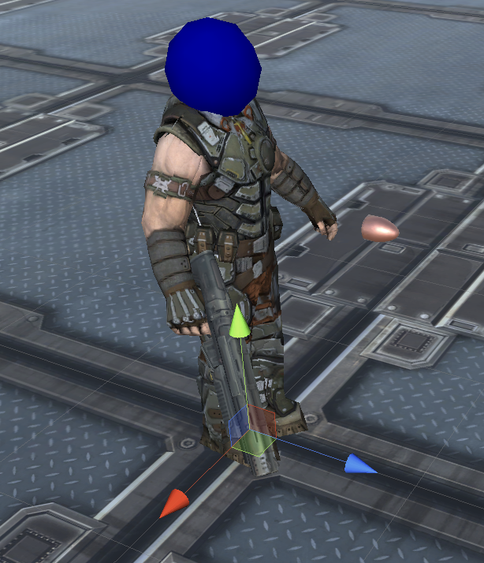
3. 총알을 날리려면 총알이 발생되는 위치에 총알 instance를 발동시키면 된다. 
4. Player 캐릭터의 앞 부분에 총알이 나타나는 부분을 잡아내기 위해 GameObject를 하나 붙인다. 그 위치를 잡으려면 일단 실행시킨 이후 총구의 위치를 잡아낸다. 
5. 그 이후에 톱니바퀴 모양의 버튼을 눌러 Copy Component를 한 이후, 플레이를 종료시킨 이후 빈 GameObject를 추가한 이후 Paste Component as Value를 하면 그 값이 복사가 된다. 
6. 추가된 GameObject의 이름을 FirePosition으로 바꿔주자. 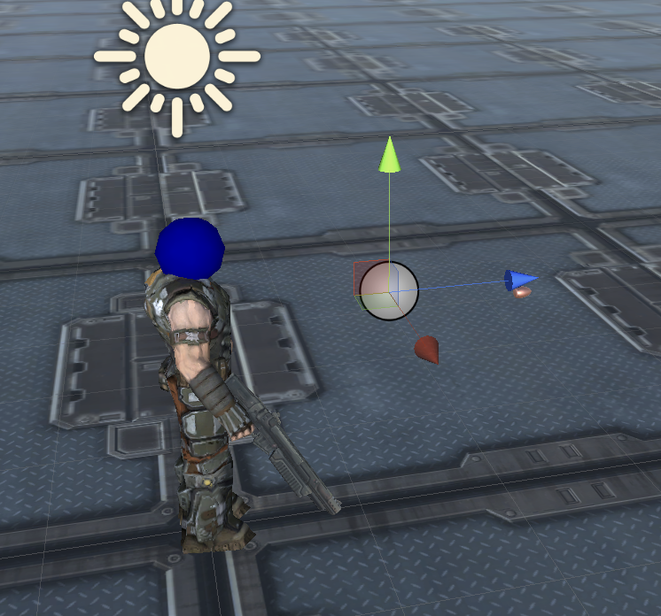


또 , 총알이 나갈때 불꽃을 튕겨보자. 

1. FirePosition 객체에 하위 객체로 GameObject를 하나 더 달아준다. 이름은 MuzzleFlash로 한다. 
2. 그리고 MuzzleFlash 객체의 속성을 다음과 같이 하기 위해 컴퍼넌트로 Mesh Renderer와 Mesh Filter를 추가한다. 
3. Mesh Filter의 Mesh는 Quad로 한다. 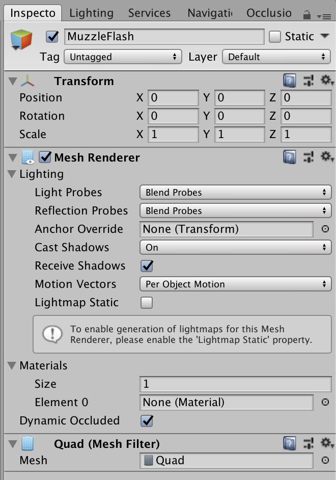
4. 그러면 아래와 같은 화면이 만들어진다. 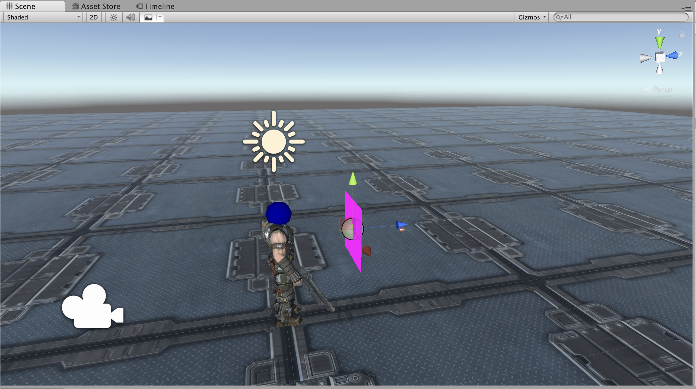
5. 이제 여기에 Material을 만들어 씌워주면 된다. 적당한 총구 사진을 검색해서 다운받은 이미지로 material을 만들어준다. 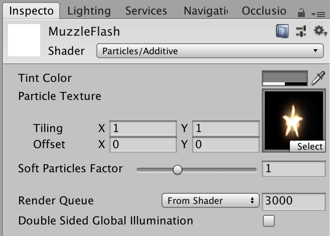
6. 만든 material을 MuzzleFlash의 material에 끌어다 넣어준다. 
7. 아래처럼 바뀐다. 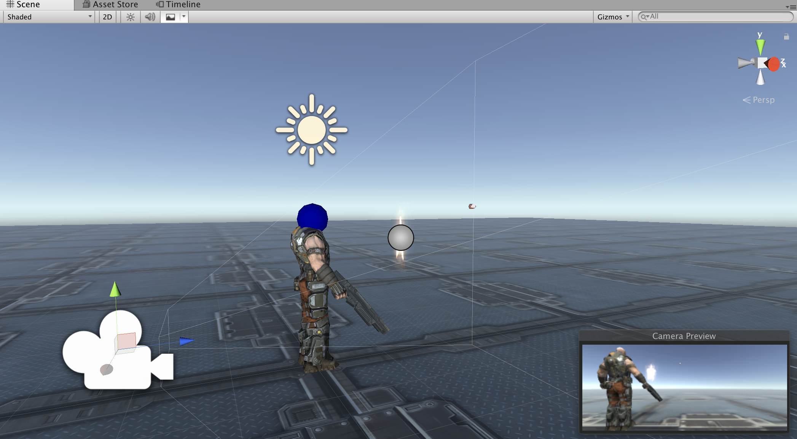


이제 총을 쏴보자. 

1. C# script를 FireControl 이란 이름으로 추가하고 다음 코드를 입력한다. 

```csharp

using System.Collections;
using System.Collections.Generic;
using UnityEngine;

public class FireControl : MonoBehaviour {

    public MeshRenderer muzzleFlash;
    public GameObject bullet;
    public Transform firePos; // 위치정보만 가져올 것이므로 ...

    public AudioClip fireSfx;

    private AudioSource _audio;

     // Use this for initialization
     void Start () {
        _audio = GetComponent<AudioSource>();
        muzzleFlash.enabled = false ;
    }
    
     // Update is called once per frame
     void Update () {
        if (Input.GetMouseButtonDown( 0 ))
        {
            Fire();
        }
    }

    void Fire()
    {
        Instantiate(bullet, firePos.position, firePos.rotation);
        _audio.PlayOneShot(fireSfx, 0.8f ); // Play 함수를 쓰면 두번째 재생시 전에 것이 끊김
        StartCoroutine(ShowMuzzleFlash());
    }

    IEnumerator ShowMuzzleFlash()
    {
        Vector3 scale = Vector3.one * Random.Range( 1.0f , 3.0f );
        muzzleFlash.transform.localScale = scale;                   // 불꽃의 크기가 랜덤하게 바뀌도록 함 .

        Quaternion rot = Quaternion.Euler( 0 , 0 , Random.Range( 0 , 360 ));
        muzzleFlash.transform.localRotation = rot;

        muzzleFlash.enabled = true ;
        yield return new WaitForSeconds(Random.Range( 0.1f , 0.4f ));
        muzzleFlash.enabled = false ;

    }
}


```

2. 유니티 UI 화면으로 돌아와서, FireControl 스크립트를 Player에 끌어다 달아준다. 그리고, 아래 그림과 같이 inspector를 설정한다. 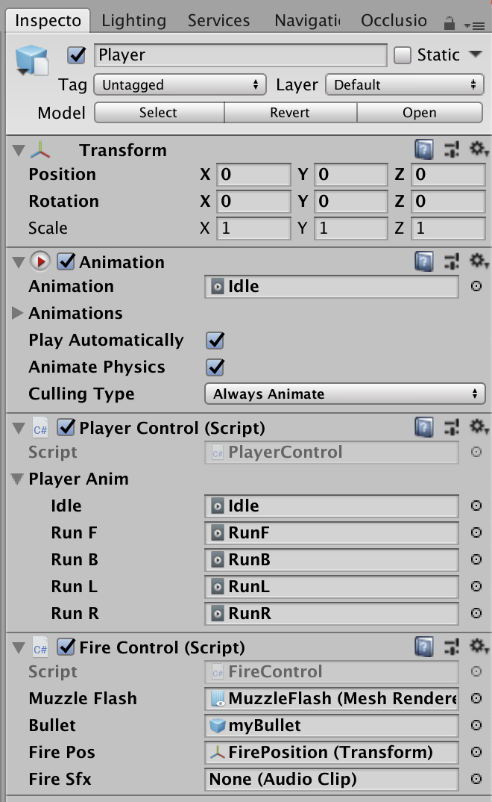
3. 컴퍼넌트로 Audio Source를 추가하고, 오디오 파일을 Fire Sfx에다 할당해주면 소리까지 난다. Audio Source 컴퍼넌트 관련해서 당장 해 줘야 할 일은 없다.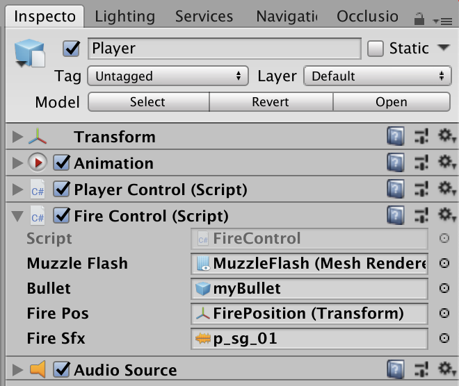
4. 총알 잘 나가고, 소리도 잘 난다.


# 총알이 드럼통에 부딪혔을때의 효과를 만들어 볼까나


배치된 Object에 총알이 닿을 경우, Collision이 발생되도록 하고 총알이 튀기면서 없어지게 하자. 

먼저 아까 만든 barrel을 Prefab으로 만들기 위해 Hierarchy에 있는 모델을 Package로 끌고오자. 
그리고 아까 만든 barrel들은 지우고 Prefab에 만든것을 가져다가 배치하자. 

이후에 해당 모델에 Capsule Collider를 배치한다. 얘의 모양을 바꿀려면 Edit Collider 를 통해서 수정한다.

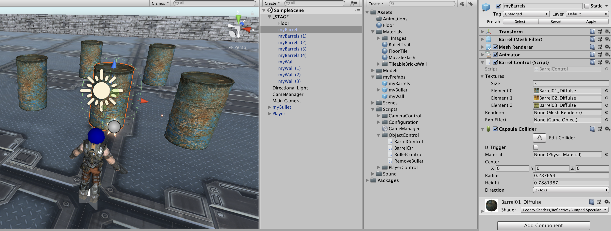

총알에 Tag 를 달아주기 위해 Add Tag를 새로 만들고 BULLET이라 입력을 해 주자. 
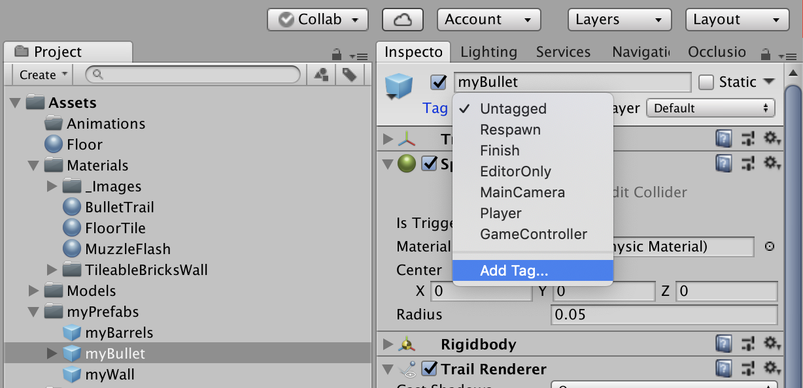

Tag 를 BULLET 이라 해 주자 . 


Barrel에 총알이 맞으면 일단 총알을 없애보자. 


```csharp
    void OnCollisionEnter( Collision coll)
    {
        if (coll.collider.CompareTag( "BULLET" ))
        {
            Vector3 pos = coll.contacts[ 0 ].point;
            Destroy(coll.gameObject);
        }


    } 


```

어라 ? 총이 통에 부딪히는 순간 오류 뿜뿜하며 죽네? 
아래처럼 해야 했다. FireControl의 Bullet에 끌어 넣는 녀석은 Prefab에서 가져와야 했어.. 
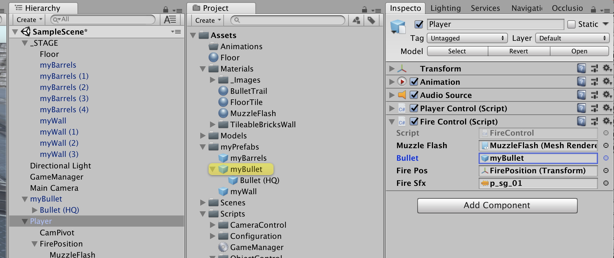

이렇게 하고 구동하면 , 총알이 부딪히는 순간 사라질 것이다 . 

자 , 이제는 총알이 부딪혔으니 , 불꽃이 튕겨야 겠지 ? 

BulletControl.cs 파일에 변수를 public 으로 하나 추가해주자 . 그리고 , Start 함수안에다 Effect 를 로드하도록 한다. 
이를 위해서는 Prefabs 폴더내에 SparksEffect를 추가해 줘야 한다. 애셋 스토어에서 적당한것 다운 받아 저 위치에 이동시켜주자. 

먼저, Assets 밑에 Resources 라는 폴더를 만들어주자. 얘는 시스템 키워드이다. 


요 밑에 Prefabs 를 만들고 , 그 아래에 SpartEffect prefab을 넣어주자. 

애셋 스토어에서 얘를 함 다운 받아보자. 

오늘은 너로 정했다. 


코드를 다음과 같이 한다 . 

```csharp
public GameObject sparkEffect;
… 

    void Start()
    {
        _renderer = GetComponentInChildren< MeshRenderer >();

        int idx = Random .Range( 0 , textures.Length);
        _renderer.material.mainTexture = textures[idx];

        sparkEffect = Resources .Load< GameObject >( "Prefabs/VfxHitSparks" );
    }

    void OnCollisionEnter( Collision coll)
    {
        if (coll.collider.CompareTag( "BULLET" ))
        {
            //if (++hitCount == 3)
            //{
            //    ExpBarrel();
            //}

            Vector3 pos = coll.contacts[ 0 ].point;   // 총알이 맞은 지점
            Vector3 normal = coll.contacts[ 0 ].normal;   // 법선 벡터

            Quaternion rot = Quaternion .LookRotation(normal);  // input 벡터를 quaternion 으로 변환
            GameObject obj = Instantiate(sparkEffect, pos, rot);

            Destroy(coll.gameObject);
            Destroy(obj, 0.3f );  // 0.3 초 후에 없애라

        }


    }


```

그리고 유니티 UI 에서 아래와 같이 하자. 
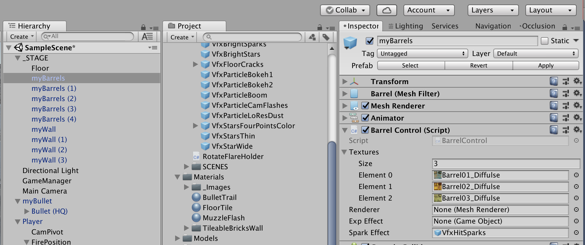


Barrel Control 스크립트의 Spark Effect 에다가 좀 전 그녀석을 끌어다 놓자. 
그리고 위에 Prefab -> Apply 버튼을 꾹! 눌러주자. 그럼 Prefab에 반영되고, 이 녀석을 활용한 모든 애들에게 적용된다. 어머? 근데 불꽃이 반대로 튀네? 그럼 코드를 이렇게 고쳐보자. 


```csharp
            Quaternion rot = Quaternion .LookRotation(-normal);  

```

제대로 튄다 . 굿 . 

자 , 이제 드럼통을 날려보자 . 꽝 ~! 
BarrelControl.cs 를 아래와 같이 하자. 
```csharp

using System.Collections;
using System.Collections.Generic;
using UnityEngine;

public class BarrelControl : MonoBehaviour
{

    public Texture [] textures;
    //[HideInInspector] // 바로 밑에 있는 것을 인스펙터에 노출시키지 않 . 그러나 외부 클래스에서 접근은 가능함
    public MeshRenderer _renderer;

    public GameObject expEffect;
    public GameObject sparkEffect;
    private int hitCount = 0 ;

    // Use this for initialization
    void Start()
    {
        _renderer = GetComponentInChildren< MeshRenderer >();

        int idx = Random .Range( 0 , textures.Length);
        _renderer.material.mainTexture = textures[idx];

        sparkEffect = Resources .Load< GameObject >( "Prefabs/VfxHitSparks" );
    }

    void OnCollisionEnter( Collision coll)
    {
        if (coll.collider.CompareTag( "BULLET" ))
        {
            if (++hitCount == 3 )
            {
                ExpBarrel();
            }

            Vector3 pos = coll.contacts[ 0 ].point;   // 총알이 맞은 지점
            Vector3 normal = coll.contacts[ 0 ].normal;   // 법선 벡터

            Quaternion rot = Quaternion .LookRotation(-normal);  // input 벡터를 quaternion 으로 변환
            GameObject obj = Instantiate(sparkEffect, pos, rot);

            Destroy(coll.gameObject);
            Destroy(obj, 0.3f );  // 0.3 초 후에 없애라

        }


    }

    void ExpBarrel()
    {
        // rundtime 시에 rigidbody 를 추가할 수 있음
        Rigidbody rb = this .gameObject.AddComponent< Rigidbody >();
        rb.AddForce( Vector3 .up * 1500.0f );

        GameObject obj = Instantiate(expEffect, transform.position, Quaternion .identity);
        Destroy(obj, 5.0f );
    }
}


```

그리고 애셋 스토어에서 BOOM~! 에 써먹을 이펙트 애셋을 다운로드해서 달아주자. 


이 넘으로 함 해보자 . 

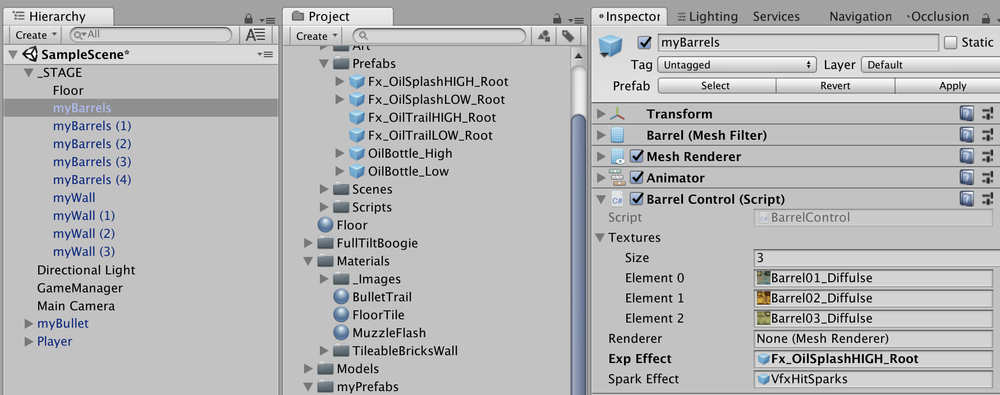

얘를 끌어다가 Exp Effect 에다가 넣어주자 . 

플레이!!! 

어머? 근데 안 터지네?? 

아래와 같이 Play On Awake를 enable하자. 
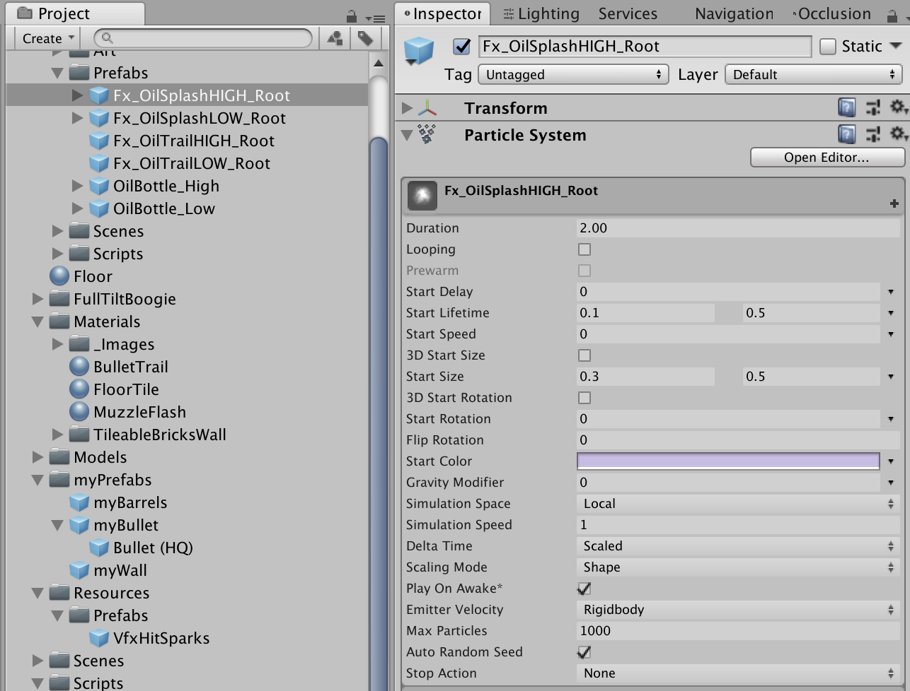
 

이제 터진다 . 빠방 ~!! 

어 ? 근데 위로 그대로 날라갔다가 그대로 돌아오네? 그럼 재미없지. 

아래처럼 바꾸자. 

```csharp
using System.Collections;
using System.Collections.Generic;
using UnityEngine;

public class BarrelControl : MonoBehaviour
{

    public Texture [] textures;
    //[HideInInspector] // 바로 밑에 있는 것을 인스펙터에 노출시키지 않 . 그러나 외부 클래스에서 접근은 가능함
    public MeshRenderer _renderer;

    public GameObject expEffect;
    public GameObject sparkEffect;
    private int hitCount = 0 ;

    // Use this for initialization
    void Start()
    {
        _renderer = GetComponentInChildren< MeshRenderer >();

        int idx = Random .Range( 0 , textures.Length);
        _renderer.material.mainTexture = textures[idx];

        sparkEffect = Resources .Load< GameObject >( "Prefabs/VfxHitSparks" );
    }

    void OnCollisionEnter( Collision coll)
    {
        if (coll.collider.CompareTag( "BULLET" ))
        {

            Vector3 pos = coll.contacts[ 0 ].point;   // 총알이 맞은 지점
            Vector3 normal = coll.contacts[ 0 ].normal;   // 법선 벡터

            if (++hitCount == 3 )
            {
                ExpBarrel(normal);
            }

            Quaternion rot = Quaternion .LookRotation(-normal);  // input 벡터를 quaternion 으로 변환
            GameObject obj = Instantiate(sparkEffect, pos, rot);

            Destroy(coll.gameObject);
            Destroy(obj, 0.3f );  // 0.3 초 후에 없애라

        }


    }

    void ExpBarrel( Vector3 normal)
    {
        // rundtime 시에 rigidbody 를 추가할 수 있음
        Rigidbody rb = this .gameObject.AddComponent< Rigidbody >();


        //rb.AddForce(Vector3.up * Vector3. * 500.0f);
        //Vector3 expDir = new Vector3(Random.Range(-1.0f, 0.0f), 1, Random.Range(-1.0f, 0.0f));
        Vector3 expDir = normal;


        rb.AddForce(expDir * 500.0f );

        GameObject obj = Instantiate(expEffect, transform.position, Quaternion .identity);
        Destroy(obj, 5.0f );
    }
}


```

음,.. 총알을 맞으면 조금 뒤로 밀리게 해보자. 

```csharp
using System.Collections;
using System.Collections.Generic;
using UnityEngine;

public class BarrelControl : MonoBehaviour
{

    public Texture [] textures;
    //[HideInInspector] // 바로 밑에 있는 것을 인스펙터에 노출시키지 않 . 그러나 외부 클래스에서 접근은 가능함
    public MeshRenderer _renderer;

    public GameObject expEffect;
    public GameObject sparkEffect;
    private int hitCount = 0 ;

    // Use this for initialization
    void Start()
    {
        _renderer = GetComponentInChildren< MeshRenderer >();

        int idx = Random .Range( 0 , textures.Length);
        _renderer.material.mainTexture = textures[idx];

        sparkEffect = Resources .Load< GameObject >( "Prefabs/VfxHitSparks" );
    }

    void OnCollisionEnter( Collision coll)
    {
        if (coll.collider.CompareTag( "BULLET" ))
        {

            Vector3 pos = coll.contacts[ 0 ].point;   // 총알이 맞은 지점
            Vector3 normal = coll.contacts[ 0 ].normal;   // 법선 벡터

            if (++hitCount == 3 )
            {
                ExpBarrel(normal);
            }
            else
            {
                MoveBarrel(normal);
            }

            Quaternion rot = Quaternion .LookRotation(-normal);  // input 벡터를 quaternion 으로 변환
            GameObject obj = Instantiate(sparkEffect, pos, rot);

            Destroy(coll.gameObject);
            Destroy(obj, 0.3f );  // 0.3 초 후에 없애라

        }


    }

    void MoveBarrel( Vector3 normal)
    {
        Transform _tr;

        _tr = this .gameObject.GetComponent< Transform >();
        _tr.position += Vector3 .back * Time .deltaTime + normal;

    }

    void ExpBarrel( Vector3 normal)
    {
        // rundtime 시에 rigidbody 를 추가할 수 있음
        Rigidbody rb = this .gameObject.AddComponent< Rigidbody >();


        //rb.AddForce(Vector3.up * Vector3. * 500.0f);
        //Vector3 expDir = new Vector3(Random.Range(-1.0f, 0.0f), 1, Random.Range(-1.0f, 0.0f));
        Vector3 expDir = normal;


        rb.AddForce(expDir * 1500.0f );

        GameObject obj = Instantiate(expEffect, transform.position, Quaternion .identity);
        Destroy(obj, 5.0f );
    }
}

```

뒤로 휙휙 밀리는게 쪼끔 못 마땅스럽긴 하지만… 일단 넘어가자. 

끗.

